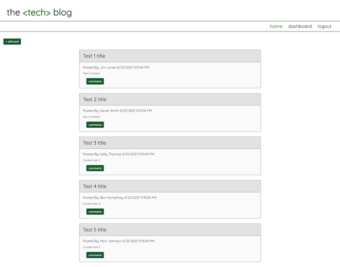

# Tech Blog

## Table of Contents
* [Description](README.md#Description)
* [Installation](README.md#Installation)
* [Usage](README.md#Usage)
* [License](README.md#License)
* [Questions](README.md#Questions)

## Description
A CMS-style blog site, where developers can publish their blog posts and comment on other developers’ posts as well. This application uses the MVC organizational system.

## Installation
To install, clone this from my repository by entering git clone https://github.com/kelseysanderson/tech_blog.git in a terminal in a new directory. Then, when successfully cloned, type `npm install` in the terminal within that directory. You will need to then enter your MySQL credentials in the .envEXAMPLE file.

## Usage
Following installation, open the terminal in the new directory and enter `node seeds/index.js` to seed the data. Following that, type `npm run watch` to start the server.

### Screenshot of Weather Dashboard

## License
Read more about the license here:
https://opensource.org/licenses/MIT

### Questions
If you have any questions, feel free to contact me:

GitHub: [Kelsey Sanderson GitHub](https://github.com/kelseysanderson)

Email:  [Kelsey Sanderson Email](mailto:kelseymonica@gmail.com)
